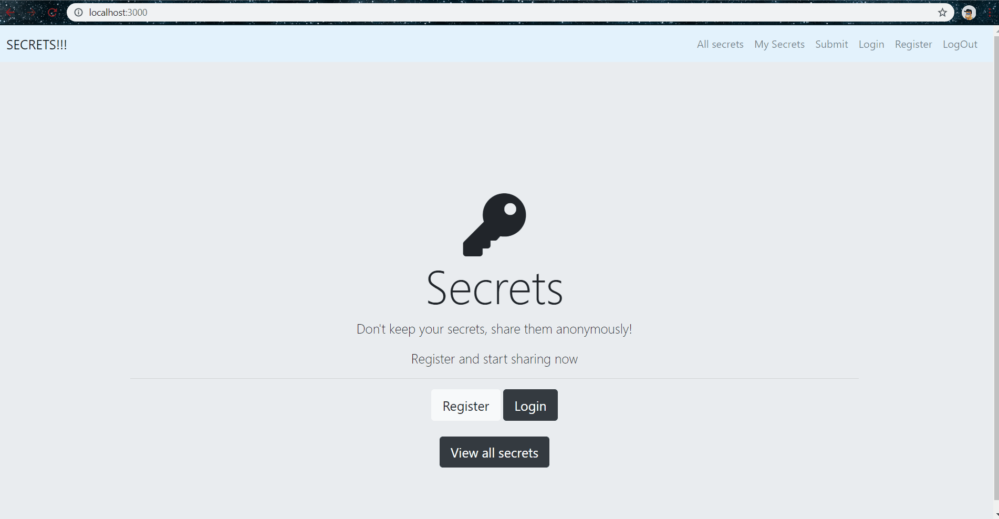

# Secrets
This is a website where users can share their secrets __anonymously__. This website has following features  
* user can register and Login on website with a Local account, Google account, Twitter account or Facebook account.
* user can post as many secrets as he wants.
* user can see his/her all shared secrets by clicking on "my secrets".
* user can delete his/her shared secret which he wants to delete.
* Anyone without even Login can see shared secrets of all users but to share a secret user has to be logged in.

## Preview


## Built With  
* [Express.js](https://expressjs.com/) - web application framework for Node.js.
* [Passport](http://www.passportjs.org/) - authentication middleware for Node.js.
* [Mongoose](https://mongoosejs.com/) - ODM library for MongoDB database and Node.js.
* [EJS](https://ejs.co/) - Embedded JavaScript templating for creating dynamic web pages.
* [Bootstrap 4](https://getbootstrap.com/) - Frontend Framework

## Getting Started
These instructions will get you a copy of the project up and running on your local machine for development.  
All the requirements are in package.json.  
First open terminal at the project root and run:  
```
$ npm install
```
Go to [Google api console](https://console.developers.google.com/) set up a new project with name Secrets fill Authorized redirect URIs with http://localhost:3000/auth/google/secrets and fill URIs with http://localhost:3000 generate CLIENT_ID, CLIENT_SECRET. similary set up a new app on [Facebook for Developers](https://developers.facebook.com/apps/) and generate FACEBOOK_APP_ID, FACEBOOK_APP_SECRET  and generate a TWITTER_CONSUMER_KEY, TWITTER_CONSUMER_SECRET from [Twitter Developers](https://developer.twitter.com/).  

next create a .env file at the project root by running following command on terminal.
```
$ touch .env
```

Put 7 variables in .env file 
SECRET=you can write anystring here  
CLIENT_ID=your google ClIENT_ID  
CLIENT_SECRET=your google CLIENT_SECRET  
FACEBOOK_APP_ID=your FACEBOOK_APP_ID  
FACEBOOK_APP_SECRET=your FACEBOOK_APP_SECRET  
TWITTER_CONSUMER_KEY=your TWITTER_CONSUMER_KEY  
TWITTER_CONSUMER_SECRET=your TWITTER_CONSUMER_SECRET

To run node development server go to terminal and run :
```
$ node app.js
```
or you can use nodemon

Run following command to install nodemon
```
$ npm install nodemon
```
To run node development server using nodemon go to terminal and run :
```
$ nodemon app.js
```
The former starts the server at port 3000  
Go to http://localhost:3000/ to go to the homepage.

## Author
* **Rahul Saxena**

